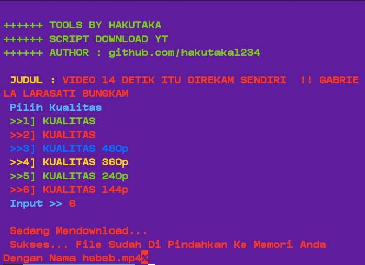
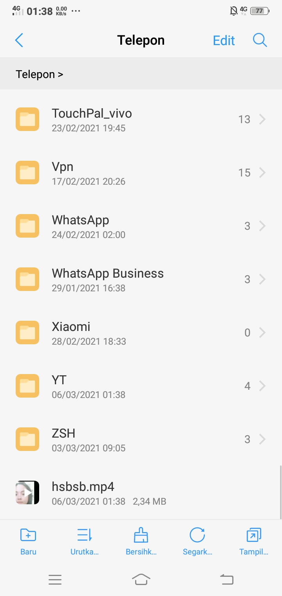

# My Social Media

[🏠FACEBOOK](https://www.facebook.com/meilin.meza)

# Tutor Install

termux-setup-storage

pkg update -y

pkg install curl -y

pkg install git -y

pkg install php -y

git clone htpps://github.com/hakutaka1234/YoutubeMp3

cd Youtubemp3

php YT.php

Kemudian Masukan Url Yang Ingin Kalian Download

Masukan Nama Lagu Jangan Makai Spasi Ya

Contoh = Hasil.mp3

Contoh = Hasil_Lagu.mp3

# Hasil Mp4

# Hasil Mp3

